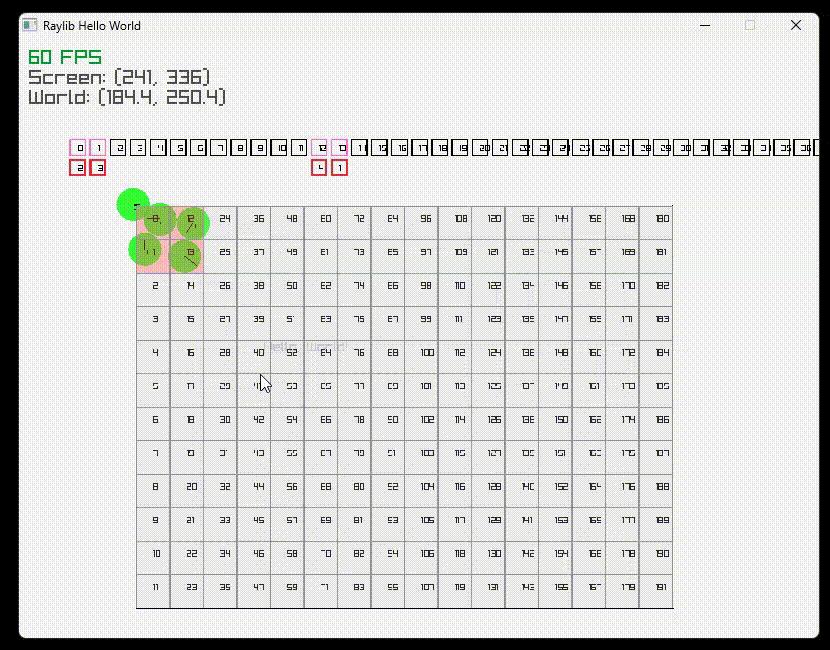
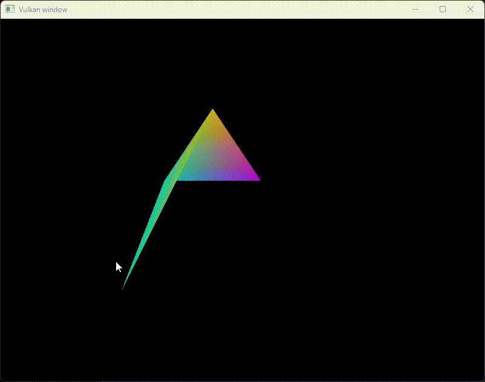

Resources

### Initial steps
- Spatial grid working. Visualized on top of the grid.
- https://matthias-research.github.io/pages/tenMinutePhysics/11-hashing.pdf
- https://www.youtube.com/watch?v=sx4IIQL0x7c 
- https://www.youtube.com/watch?v=eED4bSkYCB8

### Testing with performance
- If i remember correctly this was mainly limited by raylib rendering, which is not instanced. ( the basic renderCircle )
- https://en.wikipedia.org/wiki/Elastic_collision
- http://www.r-5.org/files/books/computers/algo-list/realtime-3d/Ian_Millington-Game_Physics_Engine_Development-EN.pdf 

### Improving rendering performance with frustum culling 
- Also started moving to 3D in order to improve rendering even further with instanced rendering.

- Initial instanced draw test with bounds. No collisions.

### Physics update
- http://www.r-5.org/files/books/computers/algo-list/realtime-3d/Ian_Millington-Game_Physics_Engine_Development-EN.pdf chapter 7
- Mass

### Playing with adding behavior to entities

### Hot reload inital testing

### Hot reload and input playback
- Playing back recorded input while testing hotreloading

### Hello triangle with vulkan

### Learning basic transforms with vulkan
